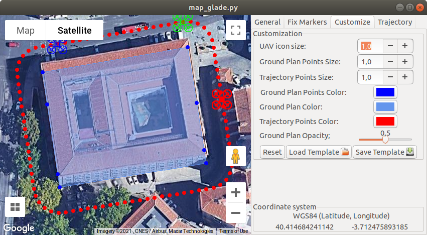

# GmapsGMLDrawing
Loading GML file onto Google Maps and displaying in GUI (Gtk) app

### A bit longer description:

Application can load GML file, read all its geometries, and deisplay it on Google Map. It gives the user an option to adjust the data (translate or rotate) or just draw new data (new points added by clicking on the map - button Add Markers). All data can be saved for use in the next session.



To start the map simply navigate to the cloned repository and write `python map_glade.py`

### More options

Checkout a branch trajectory if you need to generate and draw a trajectory around a building at specified distance.

### Dependencies
- GDAL library (use some of the following lines)
```
sudo pip install gdal
sudo apt-get install gdal-bin
sudo apt-get install python-gdal
```
- Webkit2
```
sudo apt-get install libwebkitgtk-dev
```

- Glade
```
sudo apt-get install glade
```

